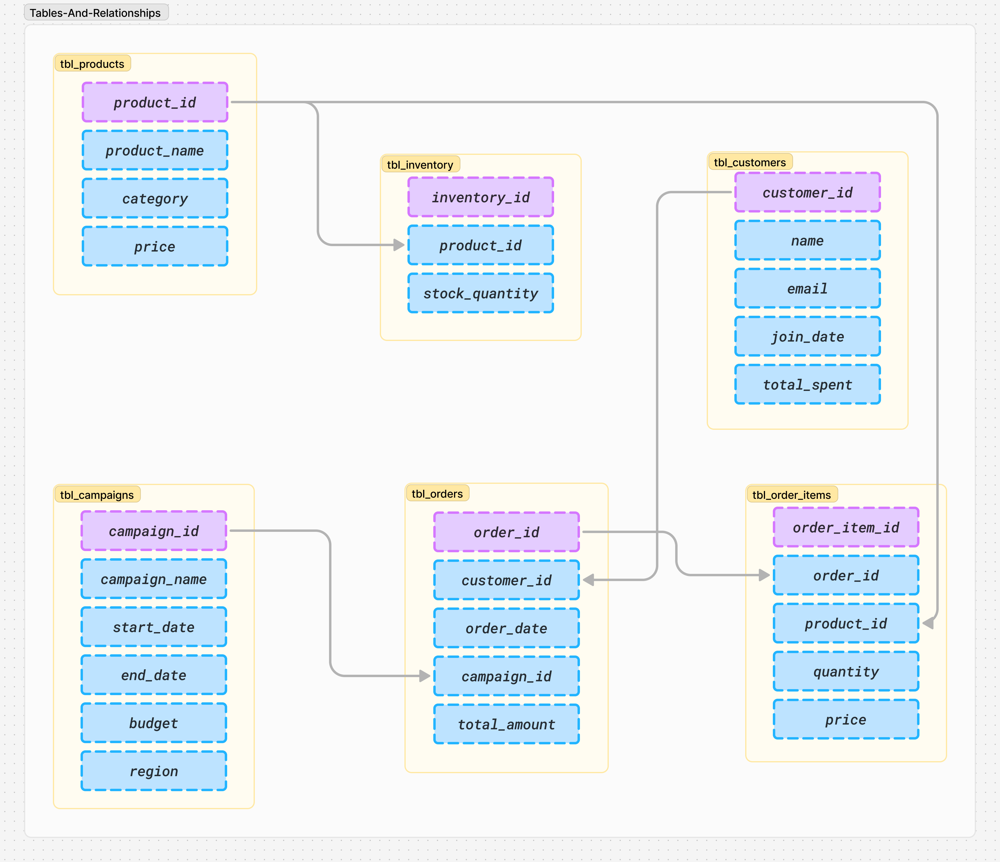
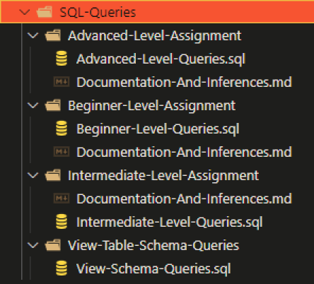

# SQL Querying for RetailMart: Summary Document

## Use Case

RetailMart, a prominent player in the retail sector, aims to enhance its operational efficiency and customer engagement through data-driven insights.

By analyzing various data points from their sales campaigns, customer behavior, and inventory management, RetailMart seeks to understand how well its initiatives are performing and where improvements can be made.

This assignment revolves around utilizing SQL to extract meaningful insights from the data, thus informing strategic business decisions.

## Goal of the Assignment

The primary goal of this assignment is to develop a robust understanding of SQL querying—from fundamental to advanced techniques.

This includes crafting well-structured queries, implementing best practices in database management, and employing analytical methods to derive actionable insights.

By doing so, the assignment endeavors to showcase how effective querying can drive better decision-making in a retail context.

## Basics of Table Schema

The following table schema outlines the core entities involved in RetailMart’s operations:

- **tbl_customers**: Stores customer information, including unique IDs, names, join dates, and total spending.
- **tbl_orders**: Captures details about customer orders, including order IDs, customer IDs, order dates, and total amounts.
- **tbl_order_items**: Contains records of individual items within each order, linking to both products and orders.
- **tbl_products**: Lists all products available for sale, along with their pricing and availability.
- **tbl_campaigns**: Details various marketing campaigns, including campaign names, budgets, and active dates.

Each table is interlinked, allowing for comprehensive data analysis that reflects customer interactions, sales performance, and inventory status.

For reference and better understanding the image is made available as follows:

## What We've Tried to Achieve

Throughout this assignment, we've constructed a series of 45+ SQL queries aimed at addressing critical business questions, including:

1. Analyzing customer spending patterns and trends.
2. Assessing product performance based on sales volume and pricing.
3. Understanding the overall effectiveness of marketing campaigns in driving sales.
4. Utilizing Common Table Expressions (CTEs) and window functions to glean deeper insights.

By leveraging these queries, we aimed to provide RetailMart with a clearer picture of their operational dynamics and guide them in strategic planning.

## How to Navigate the Assignment

The SQL Queries have been organized into the follwoing project structure:

## Outcomes

The outcomes of the SQL querying assignment can be summarized as follows:

- **Informed Decision-Making**: Through data analysis, RetailMart can make informed decisions regarding marketing strategies, inventory management, and customer engagement.
- **Enhanced Customer Insights**: The queries provided insights into customer behavior, helping identify high-value customers and potential churn risks.
- **Optimized Marketing Efforts**: By understanding campaign effectiveness, RetailMart can allocate resources more efficiently, focusing on high-impact initiatives.
- **Data-Driven Strategies**: The ability to extract and analyze data fosters a culture of data-driven decision-making within RetailMart, paving the way for ongoing improvements in operations.

This assignment emphasizes the importance of mastering SQL querying techniques as a foundational skill for data analysis, ultimately equipping RetailMart with the tools necessary to navigate the competitive retail landscape effectively.

---
